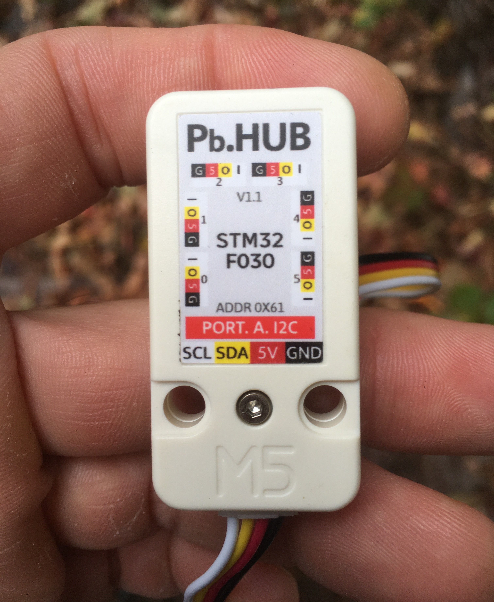

# M5_PbHub

Simple library for the (M5Stack PbHUB v1.1)[https://docs.m5stack.com/en/unit/pbhub_1.1].




## Usage

### Code to add to global space (i.e. before `setup()` )

```arduino
#include <M5_PbHub.h>
M5_PbHub myPbHub;
```

### Code to add to `setup()`

The following line of code must be added to setup():
```arduino
myPbHub.begin();
```

If a unit with pixels is connected to the PbHUB, you should initialize the pixel count immediatly aftewards:
```arduino
myPbHub.setPixelCount( uint8_t channel ,  uint16_t count );
```

### Code within `loop()`

Gets the digital value (0 or 1) of the *I* pin for the indicated channel :
```arduino
int value = myPbHub.digitalRead(uint8_t channel);
```

Writes a digital value (0 or 1) to the *O* pin for the indicated channel :
```arduino
myPbHub.digitalWrite(uint8_t channel, uint8_t  value);
```

Gets the analog value of the *I* pin for the indicated channel :
```arduino
int value = myPbHub.analogRead(uint8_t channel);
```

Sets the PWM of to the *O* pin for the indicated channel :
```arduino
myPbHub.analogWrite(uint8_t channel, uint8_t pin, uint8_t  pwm);
```


Sets the r,g,b color of the pixel specified at that index for the indicated channel :
```arduino
myPbHub.setPixelColor(uint8_t channel, uint16_t index, uint8_t r,int8_t g, uint8_t b);
```

Starting from the index, sets a certain count of pixels to the same r,g,b color on the indicated channel : 
```arduino
myPbHub.fillPixelColor(uint8_t channel, uint16_t start, uint16_t index, uint8_t r,int8_t g, uint8_t b);
```
